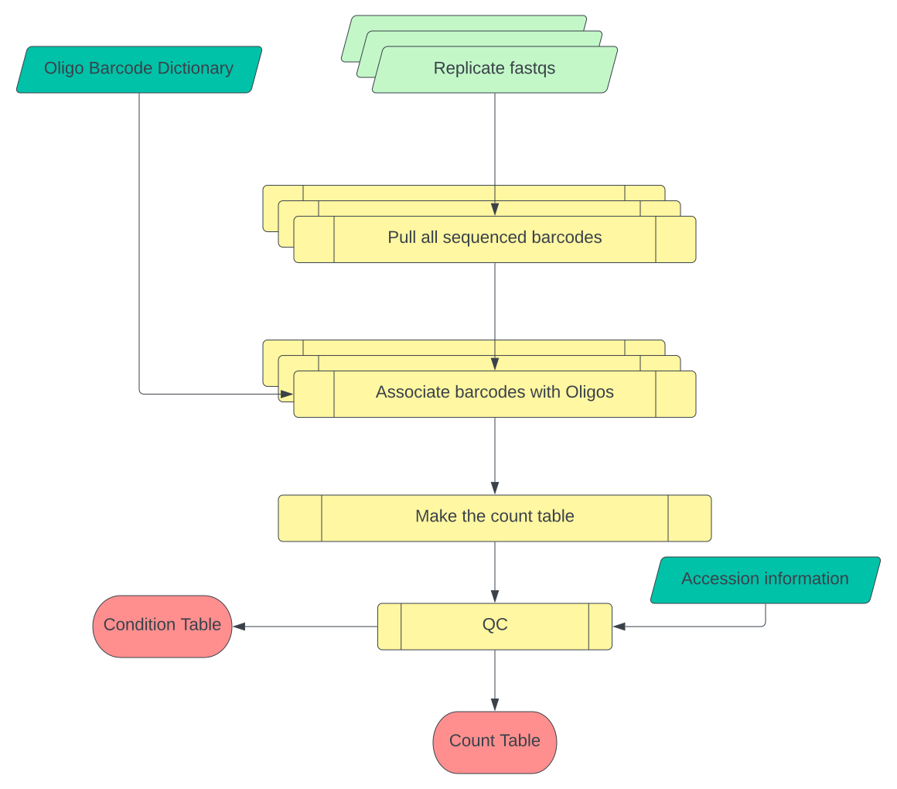

# MPRAcount - Second Module: MPRAcount (Barcode counting pipeline)

### Pipeline Flowchart



* Tiled green object represents arrays of files and information passed to the pipeline, 
* Turquoise object represents the output of the MPRAmatch pipeline, 
* Yellow objects refer to scripts written for the pipeline, 
* Red represents the final count table.


### Pipeline Description

The array of fastq files are processed in parallel and the barcodes, along with the barcode-oligo dictionary, are passed to a script which associates the barcodes with the matching oligo. These files are then passed to a script which organises the matched barcodes and oligos into a count table.
This pipeline is written in the Workflow Description Language (WDL) version 1.0 more info [here](https://github.com/openwdl/wdl)

### Parameters for MPRAcount.wdl

There are several optional inputs that can be changed based on a different library preparation.
 - `MPRAcount.bc_len` : Integer, default to 20. Length of barcodes to be pulled from replicate files
 - `MPRAcount.flags` : String, default to "-ECSM -A 0.05" Any combination of these flags or none can be used.


### MPRAcount git repo directory structure in MPRASuite:

```
    - cloned_repository/  
      - environment
      - graphics
      - LICENSE.txt
      - MPRAcount
        - example
        - execution
        - MPRAmatch.wdl
        - output_file_explanations.md
        - README.md
        - scripts
        - setup
      - README.md
      - scripts
      - setup

```


## Setting up the environment:

We have the whole environment containerized, the definition file is available in the `environment/` folder of this repository.

If you are unable to run the pipeline via a container, then set up your environment as described below:

* Have modules for Cromwell, Womtool, FLASH2, minimap2 (version 2.17), preseq, pandas, reshape2, ggplot2, gridextra, and Biopython available (`.yml` of this conda enviornment can be found in the environment tab)
  * `conda install -c bioconda cromwell womtool flash2 minimap2=2.17 preseq pandas samtools`
  * `conda install -c conda-forge r-reshape2 r-ggplot2 r-gridextra biopython`

* Make sure the contents of the git repo once cloned are in a known directory (you will need to provide the path to this directory)

* WDL does not get rid of intermediate files. The  pipelines are set up to relocate files that are important for later use from where the pipeline is run to a more permanent location. Consider running the pipeline in a scratch area so you don't have to go and delete other intermediate files after the pipeline completes itself. If you do opt to delete the files manually, please check that the relocation at the end of the pipeline has completed.


# Steps to prepare and run MPRAcount:

**1. Clone Repo (or Pull Updated repo):**

`  git clone https://github.com/tewhey-lab/MPRASuite.git  `


**2. Create `acc_id_reps.txt` file (by the user):**

This file `<library_name>_acc_id_reps.txt` should be manually created prior to creating the MPRAcount specific config file (described in the next step).
This file should contain 4 columns: 1→ Sample Ids, 2→ plasmid/cell-type replicate, 3→ biotype name (DNA for plasmid and cell type names for their respective cell-types), 4→ type (DNA for Plasmid and RNA for cell-types). No header line should be included in the final file. An example of the file with plasmid (3 replicates) and 2 cell-types namely: A549 (2 replicates with one file each) and Jurkat (3 replicates) is shown below:

**Note:** If the sequencing for read1 and read2 results in multiple files for both (i.e. multiple lanes or split between plates) when concatenating them into a single read1 file and read2 file make sure paired files are in the same order between both fastqs. (read1 followed by read2 for same sample). Example:

```

OL111_Plasmid_r1_GT11-15046_CAGCGGTA-CCAAGTCA_S19_R1_001.fastq.gz Plasmid_r1  DNA  DNA
OL111_Plasmid_r2_GT11-15047_CAGCGGTA-CCAAGTCA_S20_R1_001.fastq.gz Plasmid_r2  DNA  DNA
OL111_Plasmid_r3_GT11-15048_CAGCGGTA-CCAAGTCA_S21_R1_001.fastq.gz Plasmid_r3  DNA  DNA
OL111_A549_r1_GT23-15040_TCTCCAAC-AGATGAGA_S22_R1_001.fastq.gz  A549_r1  A549  RNA
OL111_A549_r2_GT23-15041_TCTCCAAC-AGATGAGA_S23_R1_001.fastq.gz  A549_r1  A549  RNA
OL111_Jurkat_r1_GT23-15042_CAACTCTC-GAGAAGAT_S27_R1_001.fastq.gz  Jurkat_r1  Jurkat  RNA
OL111_Jurkat_r2_GT23-15043_CAACTCTC-GAGAAGAT_S28_R1_001.fastq.gz  Jurkat_r2  Jurkat  RNA
OL111_Jurkat_r3_GT23-15044_CAACTCTC-GAGAAGAT_S29_R1_001.fastq.gz  Jurkat_r3  Jurkat  RNA


```


**3. Create MPRAcount specific config file (by the user):**

Copy the below content and substitute the inputs for each parameter as required and save the file as, for example: `OL111_MPRAcount.config` (see example below).

**Note:** The variable `proj` and `library_rerun_name` can be the same string when running the pipeline with in-buit settings and parameter values, the variable `library_rerun_name` can be changed when the library is analyzed for a different setting/parameter and the pipeline can be run with updated config file to create a new output folder with respective files.


```
export gitrepo_dir="/path/to/cloned/repo/MPRASuite"
export jq_container="/path/to/images/jq.sif"
export mpra_oligo_container="/path/to/images/mpra_oligo_barcode.sif"


export mpramatch_dir="/path/to/MPRAmatch_output_dir YYMMDD-HHMMSS_<library_name>"
export acc_reps_file="/path/to/<library_name>_acc_id_reps.txt"
export library_rerun_name="<libray_name>"
export proj="<library_name>"

```


**4. Run the MPRAmatch pipeline:**

The command to execute the pipeline need 3 inputs (see example below): 
* '-J' string for job name provided by the user which will be appended to the slurm standard error and output files to better tracking,
* absolute path to MPRAcount_run.sh script within the git repo,
* absolute path the MPRAcount.config file. This command can be executed directly from the terminal.

```
  sbatch -J "<library_name>" </path/to/MPRASuite/MPRAcount/execution/MPRAcount_run.sh> </path/to/<library_name>_MPRAcount_config.file

```

**5. Quick QC - Manually check the json file (intermediate file):**

The file `MPRAcount_<library_name>_inputs.json` can be checked in the folder: `YYMMDD-HHMMSS_<library_name>/execution/YYMMDD-HHMMSS_<library_name>_MPRAmatch/YYMMDD-HHMMSS_<library_name>_MPRAcount` . It is a good practice to check and make sure the default and user provided arguments in the config file have parsed successfully. An example of `json` file is below:


```
{
  "MPRAcount.parsed": "/path/to/<library_name>.merged.match.enh.mapped.barcode.ct.parsed",
  "MPRAcount.acc_id": "/path/to/<library_name>_acc_id_reps.txt",
  "MPRAcount.working_directory": "/path/to/git/repo/MPRASuite/MPRAcount/scripts",
  "MPRAcount.out_directory": "/path/to/YYMMDD-HHMMSS_<library_name>/outputs/MPRAmatch/YYMMDD-HHMMSS_<library_name>_MPRAcount",
  "MPRAcount.id_out": "<library_name>",
  "MPRAcount.replicate_fastq": [
    /path/to/replicate/fastqs/for/each/celltype
  ],
  "MPRAcount.replicate_id": [
    replicate_ids
  ]
}
``` 

**Note:** The run folder name with `YYMMDD-HHMMSS_<library_name>` string for MPRAmatch will be different for the output folder created for MPRAcount `YYMMDD-HHMMSS_<library_name>_MPRAcount` since these pipelines are are expected to execute at different time points.


**6. Check the output folders:**

Below is the output run directory organization chart. The output folder structure is preserved from the MPRAmatch pipeline and the output folders from MPRAcount will be added.

```
   - YYMMDD-HHMMSS_<library_name>/
    - execution
      - YYMMDD-HHMMSS_<library_name>_MPRAmatch
        - cromwell-executions
        - cromwell-workflow-logs
        - MPRAmatch_<library_name>_inputs.json
        - MPRAmatch_<library_name>_call.sh
      - YYMMDD-HHMMSS_<library_name>_count
        - cromwell-executions
        - cromwell-workflow-logs
        - MPRAcount_<library_name>_inputs.json
        - MPRAcount_<library_name>_call.sh
    - inputs
      - <library_name>_R1.fastq.gz
      - <library_name>_R2.fastq.gz
      - <library_name>_reference.fastq.gz
      - <cell_types>.fastqs.gz
    - outputs
      - MPRAmatch
        - <library_name>.merged.match.enh.mapped.barcode.ct.parsed
        - YYMMDD-HHMMSS_<library_name>_MPRAcount/
    - slurm_logs
      - YYMMDD-HHMMSS_<library_name>_MPRAmatch_cromwell-workflow-logs
      - YYMMDD-HHMMSS_<library_name>_MPRAcount_cromwell-workflow-logs

```

Detail explanation of output files about their header and columns can be found [here](./output_file_explanations.md)

The output files needed for the `MPRAmodel` pipeline can be found at:

* Count File       : `- YYMMDD-HHMMSS_<library_name>/MPRAmatch/YYMMDD-HHMMSS_<library_name>_MPRAcount/<library_name>.count`
* Condition file   : `- YYMMDD-HHMMSS_<library_name>/MPRAmatch/YYMMDD-HHMMSS_<library_name>_MPRAcount/<library_name>.condition.txt`


### Running WDL pipeline as a standalone script:

At any given point if the user would like to run/test the WDL pipeline as a standalone script for their library with a different setting or parameter applied to any tool or software, the json file generated above will be required as an argument to the below script.

**a. To submit to `slurm` from terminal:**

Make sure you give the pipeline enough memory to run, if the pipeline fails the first time you run it, look at the end of the slurm output file to determine whether you need to      give it more time or more memory

` sbatch -p compute -q batch -t 24:00:00 --mem=45GB -c 8 --wrap "cromwell run /path/to/MPRAcount.wdl --inputs /path/to/MPRAcount_<library_name>_inputs.json"`

**b. To submit using the runscript:**

  **b1. Copy the below code and save it in a file named `MPRAcount_call.sh`. Make sure to update the paths and locations.**

  Runscript:

  ```
  echo "Running Cromwell"

  cromwell run /path/to/MPRASuite/MPRAcount/MPRAcount.wdl --inputs /path/to/YYMMDD-HHMMSS_<library_name>/execution/YYMMDD-HHMMSS_<library_name>_MPRAcount/MPRAcount_<library_name>_inputs.json

  echo "Finished Cromwell"

  ```


   **b2. Copy the below code to create a submission template (for a SLURM based scheduler):** 
   
   Make sure to update the parameters: `--job-name=` with preferably the `library_name`, `--mail-user=` with the email id of the user, path to the container and runscript created bove and save in a file, example MPRAcount_run.sh. The below script can be submitted by running `sbatch /path/to/MPRAcount_run.sh` 

    ```
    #!/bin/bash
    #SBATCH --job-name= <library_name>
    #SBATCH -p compute # partition(this is the standard)
    #SBATCH -q batch
    #SBATCH -N 1 # number of nodes
    #SBATCH -n 45 # number of cores
    #SBATCH --mem 200GB # memory pool for all cores
    #SBATCH -t 3-00:00 # time (D-HH:MM)
    #SBATCH --mail-type=END,FAIL
    #SBATCH --mail-user= <your_email_here>

    echo "Loading Singularity Module"
    module load singularity

    echo "Executing SIF with Code"
    singularity exec /path/to/your/built/container sh /path/to/runscript/MPRAcount_call.sh
    echo "Done"

    ```


