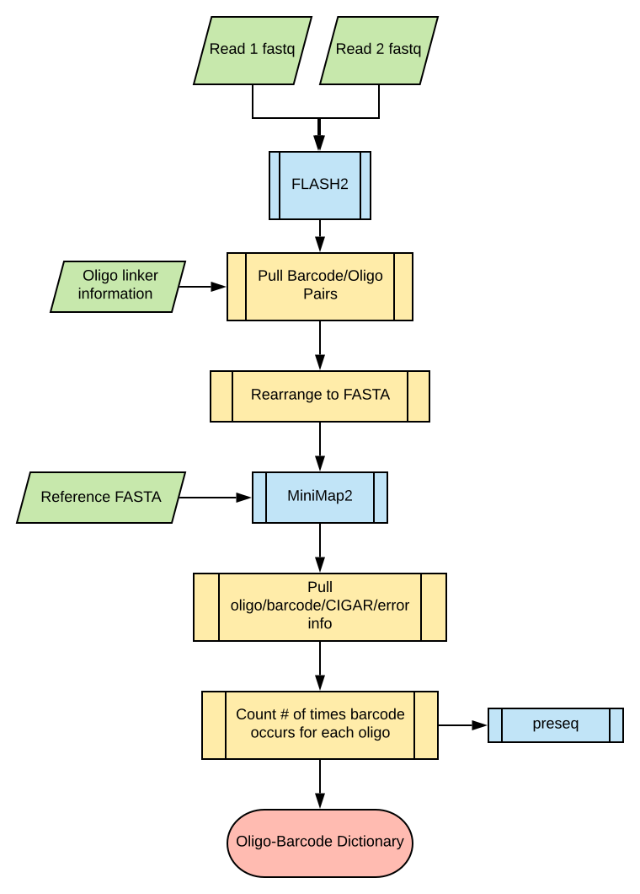

# MPRAmatch (MPRA Oligo/Barcode Reconstruction)

## Pipeline Flowchart




* **Green** objects represent files and information provided to the pipeline, which are directly passed to a script or program.
* **Blue** objects represent calls to the modules mentioned above.
* **Yellow** objects denote scripts specifically designed for the pipeline.
* **Red** objects represent the barcode-oligo dictionary.

## Pipeline Description

This pipeline is implemented in the **Workflow Description Language (WDL)** version 1.0. Further details on WDL can be found [here](https://github.com/openwdl/wdl).

* The process begins with the input of two fastq files generated from the initial barcode-oligo sequencing, which are merged into a single fastq using FLASH2. * Subsequently, barcode and oligo sequences are extracted for each record in the merged fastq, based on the linker sequences between the barcode and oligo, as well as at the end of the oligo.
* The extracted barcode/oligo pair information is then reformatted into FASTA format and provided to MiniMap2, along with the reference fasta.
* The resulting SAM file is parsed to retrieve information such as Oligo name, barcode sequence, CIGAR, and error details for each mapped record.
* Following this, the frequency of each barcode appearing for each oligo is determined.
* The output is directed to preseq for sequencing depth analysis and further parsed to address instances where barcodes map to multiple oligos.

**1. Clone Repo (or Pull Updated Repo):**

```
git clone https://github.com/tewhey-lab/MPRASuite.git && cd MPRASuite
```
<br>

**2. **_QC-check:_** Check the MPRAmatch git repository directory structure :**

To ensure proper cloning of the repository, please examine the directory structure provided below. <br>
(**Note:** There are additional folders for other modules, but for the purpose of this instruction, focus on examining only the MPRAmatch folder.)
<br>

```
    - MPRASuite/
      - example
      - graphics
      - LICENSE.txt
      - README.md
      - MPRAmatch
        - execution
        - MPRAmatch.wdl
        - output_file_explanations.md
        - README.md
        - scripts
        - setup
      - MPRAcount
      - MPRAmodel

```
<br>

**3. Creating MPRA SIF(singularity image file):**

MPRA image file will contain all the tools and their dependancies needed for the pipeline to analyze the datasets. 
To install a Docker image from Quay.io and converting it into a singularity image to be able to use on the Linux system, ensure having singularity installed on your system and please follow the below commands:

**a. Pull the Docker image from Quay.io and convert into SIF file:**
<br>
Open a terminal and run the following command:

<br>

```
singularity run docker://quay.io/harshpreet_chandok/mprasuite:latest
```
<br>

**b. Ensure the SIF file is created correctly:**
<br>
```
./mprasuite.sif
```
<br>
If the installation is successful, executing this command will list all the tools, software, and libraries along with their versions in the image file for better tracking. If no list is generated, there may be issues with the installation.

<br>
<br>
**4. Getting the input files ready:**

The user is responsible for manually generating two files namely ```<library_name>_acc_id.txt```and ```MPRAMatch_<library_name>.config```, which are required inputs for the pipeline to proceed. The filenames can be customized by the user, but it is crucial to ensure that the correct file names and formats (see below) are provided to the pipeline.
<br>

a.  **acc_id.txt:**
<br>

The text file must contain two columns: the first column should include the full paths to delta GFP files (containing the sequences of the reporter gene (e.g., GFP) along with the regulatory elements (e.g., enhancers, promoters) being tested in the MPRA experiment) in fastq.gz format, while the second column should contain the respective <library_name>_read_number. Column headers are not required in the file.

<br>

**Note:** If sequencing for read1 and read2 produces multiple files for both, (e.g., multiple lanes or split between plates), ensure that forward and reverse sequencing files for a given lane are listed together with forward files listed first:


```
/path/to/OL111_deltaGFP-A_GT23-13735_GACCAGGA-ATAGCCAG_S91_L007_R1_001.fastq.gz OL111_r1
/path/to/OL111_deltaGFP-A_GT23-13735_GACCAGGA-ATAGCCAG_S91_L007_R2_001.fastq.gz OL111_r2
/path/to/OL111_deltaGFP-B_GT23-13736_TGCTGCTG-ATGAGGAC_S92_L007_R1_001.fastq.gz OL111_r1
/path/to/OL111_deltaGFP-B_GT23-13736_TGCTGCTG-ATGAGGAC_S92_L007_R2_001.fastq.gz OL111_r2
/path/to/OL111_deltaGFP-B_GT23-13736_TGCTGCTG-ATGAGGAC_S92_L008_R1_001.fastq.gz OL111_r1
/path/to/OL111_deltaGFP-B_GT23-13736_TGCTGCTG-ATGAGGAC_S92_L008_R2_001.fastq.gz OL111_r2

```
<br>

b.  **MPRAmatch specific config file:**
<br>

Below is the provided content with parameters that can be substituted as needed. Here we have named the file ```OL111_MPRAmatch.config``` , we recommend the following naming convention.  (see example below). <br>
**Note:** The variables ```proj``` and ```library_rerun_name``` should be a string (library name) that will be appended to name the run folder. For example: ```231103-233906_OL111```. If the user runs the pipeline with default settings both variable can have the same string and ```OL111``` will be used as prefix to name all the output files. To run tests with different settings, you can rename only the main folder by appending a unique string to the library name ```library_rerun_name``` so that it can be differentiated with the other run folders in the directory (if any), all the output files will follow the ```proj``` passed by the user.
<br>
<br>
*We offer users the flexibility to provide a JSON file with their preferred library design settings. If no JSON file is specified in the config file, the pipeline will default to the standard settings and generate a JSON file accordingly.

<br>

```
##Input parameters for MPRAmatch

export gitrepo_dir="/path/to/github/MPRASuite"
#export mpra_container="/projects/tewhey-lab/images/MPRASuite-MPRAmatch_MPRAcount_v1.sif" (path on sumner)
export mpra_container="/path/to/the/sif_file/from/docker"

export acc_file="/path/to/<library_name>_acc_id.txt"
export fasta="/path/to/reference_fasta"
export proj="<library_name>"
export results_dir="<path/to/desired/directory/for/results>" 
export library_rerun_name="<library_name or folder_name_for_rerun>" 

#leave the variable blank if not providing customized json file,the pipeline will utilize the default parameters to generate the JSON and continue processing
export MPRAmatch_json="<path/to/user/json/customized/file>"

#leave the variable blank if singularity is installed in the PATH
export singularity="/path/to/installed/singularity"

```
<br>

**5A. Run the MPRAmatch pipeline on a SLURM cluster:**

The pipeline execution command requires three inputs (refer to the example below):

A user-provided string for the job name (```-J```), which will be added to the slurm standard error and output file names for improved tracking.
The absolute path to the ```MPRAmatch_run.sh``` script within the git repository.
The absolute path to the ```MPRAmatch.config``` file. 
This command can be executed directly from the terminal.

```
sbatch -J "<library_name>" </path/to/MPRASuite/MPRAmatch/execution/MPRAmatch_run.sh> </path/to/<library_name>_MPRAmatch_config.file

```
<br>

 **5B. Run the MPRAmatch pipeline on a linux workstation:**

The pipeline execution command requires two inputs (refer to the example below):

The absolute path to the ```MPRAmatch_run_non-slurm.sh``` script within the git repository.
The absolute path to the ```MPRAmatch.config``` file. 
This command can be executed directly from the terminal.

```
bash </path/to/MPRASuite/MPRAmatch/execution/MPRAmatch_run_non-slurm.sh> </path/to/<library_name>_MPRAmatch_config.file

```
<br>
 
 **6. Explore the output folder:**

The output folder will be generated at the path specified in the config file (parameter ```results_dir```) with a date and time stamp appended to the folder name as a suffix followed by ```<library_name>```. Within the main parent folder, subfolders will be created namely ```execution```, ```inputs```, ```outputs```, and ```logs```. The pipeline output files for MPRAmatch can be located under ```YYMMDD-HHMMSS_<library_name>/outputs/MPRAmatch/```.
<br>

```
   - YYMMDD-HHMMSS_<library_name>/
    - execution
      - YYMMDD-HHMMSS_<library_name>_MPRAmatch
        - cromwell-executions
        - cromwell-workflow-logs
        - MPRAmatch_<library_name>_inputs.json    
        - MPRAmatch_<library_name>_call.sh
    - inputs
      - <library_name>_R1.fastq.gz
      - <library_name>_R2.fastq.gz
      - <library_name>_reference.fastq.gz
    - outputs
      - MPRAmatch
        - <library_name>.merged.match.enh.mapped.barcode.ct.Parsed      #file needed for next module - MPRAcount
    - logs
      - YYMMDD-HHMMSS_<library_name>_MPRAmatch_cromwell-workflow-logs
```
<br>

Detailed explanations of the output files, including their headers and columns, can be found [here](https://github.com/tewhey-lab/MPRASuite/blob/main/MPRAmatch/output_file_explanations.md).
<br>

The only output file required from the MPRAmatch module for the subsequent MPRAcount pipeline will be located at:
<br>
<br>
```YYMMDD-HHMMSS_<library_name>/outputs/MPRAmatch/<library_name>.merged.match.enh.mapped.barcode.ct.parsed```
<br>
