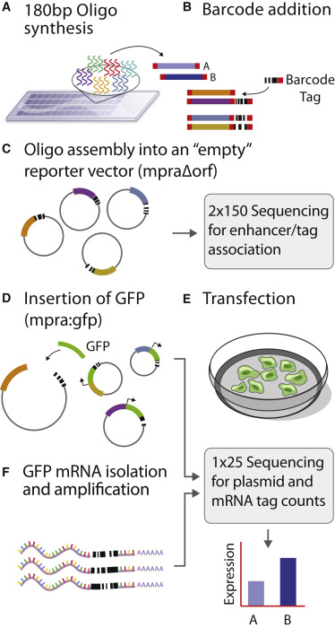

## Introduction to MPRA:

**_Multiplexed Reporter Assay (MPRA)_**, a high-throughput technique that enables the simultaneous testing of hundreds of DNA sequences for their regulatory effects on gene expression. By utilizing synthetic DNA sequences containing known genetic variants and measuring their impact on reporter gene expression, hundreds of expression-modulating variants can be identified across different genomic regions. Importantly, this method provides a comprehensive and efficient means to identify functional genetic variants associated with gene regulation, offering valuable insights into the genetic basis of complex traits and diseases. 

## Overview of MPRA Technology:
 
 
 

 
 
**_1. MPRA Library Construction:_**
* Design and synthesize a library of DNA sequences containing genetic variants of interest, such as SNPs or other regulatory variants.
* Attach unique barcodes to single-stranded DNA fragments, convert them to double-stranded DNA using emulsion PCR, and insert them into a reporter vector (with the reporter gene removed) to create the mpra:Δorf library.
* Insert a minimal promoter and GFP open reading frame into the plasmid library by cutting it between the barcode and oligo sequence using Gibson assembly, resulting in the mpra:gfp library.

**_2. Library Transfection into Cells:_**
* Transfect the synthesized mpra:gfp library into cells using an appropriate transfection method.
* Each DNA sequence within the library is linked to a unique barcode, enabling the quantification of its expression level.

**_3. Reporter Gene Expression Measurement:_**
* Harvest cells post-transfection and extract RNA.
* Capture and sequence mRNA to determine the expressed DNA fragment sequences.
* Compare barcode counts from sequenced mRNA to those estimated from mpra:orf library sequencing.

**_4. Data Analysis:_**
* Process sequencing data to demultiplex reads based on unique barcodes for quantifying expression levels of each DNA sequence.
* Conduct statistical analysis to identify genetic variants significantly modulating reporter gene expression.

**_5. Results Interpretation:_**
* Further characterize identified expression-modulating variants to understand their functional effects on gene expression regulation.
* Perform functional validation experiments to confirm the regulatory effects of selected variants.

## MPRASuite: MPRA Data Analysis Pipeline:

The **MPRAsuite** MPRAsuite comprises three meticulously developed pipelines designed to facilitate the analysis of Massively Parallel Reporter Assays (MPRAs) namely [MPRAmatch](./MPRAmatch), [MPRAcount](./MPRAcount), [MPRAmodel](./MPRAmodel). These pipelines are employed in conjunction with various stages of the MPRA workflow depending on the specific objectives of the library. The development of the MPRAsuite involved leveraging the framework established by [Tewhey et al.,(2016)](https://www.cell.com/fulltext/S0092-8674(16)30421-4) and generalizing the procedural steps to enable the execution of data analysis on any given MPRA library with minimal input requirements.

### Please see the below links associated to each of the three pipelines for detail documentation/Readme:

* [MPRAmatch](./MPRAmatch/README.md) - MPRA Oligo/Barcode Reconstruction Pipeline
* [MPRAcount](./MPRAcount/README.md) - MPRA Barcode Counting Pipeline
* [MPRAmodel](./MPRAmodel/README.md) - Statistical Analysis and Interpretation Pipeline
